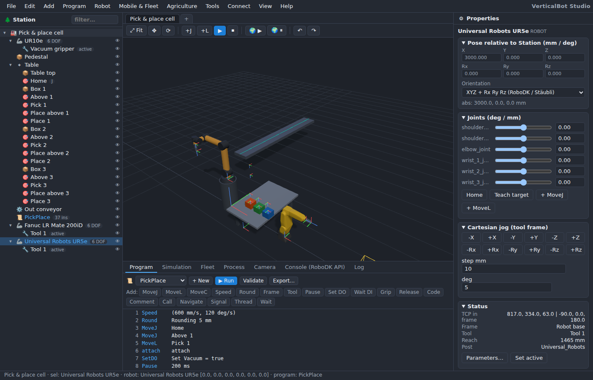

# The user interface

## Layout

- **Menu bar** — File, Edit, Add, Program, Robot, Mobile & Fleet, Agriculture, Tools, Connect, View, Help.
- **Station tree** (left) — items of the open station: robots (with tools as children), frames, targets,
  programs, objects, folders, mobile robots, fleets, maps, zones, fields, missions, process components,
  cameras. Drag items to re-parent them; drop a robot onto a rail/gantry robot to mount it. The filter box
  narrows the tree. Right-click for the context menu; the eye icon toggles visibility.
- **3D view** (centre) — orbit with the left mouse button, pan with the right button / Shift, zoom with the
  wheel. `F` fits everything, *View › Top/Front/Side/Isometric* sets standard views. The toolbar has *Fit*,
  gizmo translate/rotate, *+J* / *+L* teach buttons, run/stop, world simulation start/pause, undo/redo.
  Selecting an item shows a gizmo; frames and targets can be toggled (*View › Show reference frames / targets*).
- **Properties panel** (right) — everything about the selected item: pose relative to the parent (with the
  orientation convention selector: RoboDK XYZ+RxRyRz, KUKA ABC, Fanuc/Motoman WPR, ABB quaternion, UR rotation
  vector, ZYZ), joints with sliders, Cartesian jog, robot status (TCP, frame, tool, reach, post), tool TCP,
  target type (Cartesian/joint), program settings, object geometry, mobile robot kinematics and battery, fleet,
  map, zone, field, mission and component parameters.
- **Bottom tabs** — *Program* editor, *Simulation* timeline, *Fleet* KPIs and tasks, *Process* flow
  statistics, *Camera* views, *Console (RoboDK API)* for JavaScript/API commands, *Log* messages. *View › Toggle
  bottom panel* hides it.
- **Station tabs** — several stations can be open at once (*Tools › New station tab*).

## Menus at a glance

| Menu | Contents |
|---|---|
| File | New / Open / Save station, demo stations, export program (post processor), export RoboDK API script, URDF package, save for Blender, station JSON, screenshot |
| Edit | Undo, redo, delete, rename station |
| Add | Robot from library / online library, reference frame, target, program, folder, box/cylinder/sphere, process component, import URDF/STL/program/.rdk |
| Program | New program, teach MoveJ/MoveL, run/pause/stop, validate, export with post processor, import RoboDK post processors |
| Robot | Home, add tool, fruit-picking program, follow curve/points, robot machining project (NC), move with external axes, collision checks, active robot selection |
| Mobile & Fleet | Add mobile robot, create fleet, occupancy map, zones, world simulation start/pause/reset |
| Agriculture | Create field/orchard, missions, GeoJSON import, agricultural demos |
| Tools | Collision map, measure, camera parameters, video recording, 3D HTML / glTF / animated glTF export, station tabs |
| Connect | ROS 2 via rosbridge, studio server info, VDA 5050 fleet interface |
| View | Fit, standard views, frames/targets/reach display, gizmo mode, bottom panel, language (English / Русский) |
| Help | Quick start, RoboDK API compatibility notes, about |

## Units and conventions

Lengths are millimetres, angles degrees, poses are 4×4 matrices; the world is Z-up. Item poses are relative
to the parent item; children of a robot (tools, and frames/targets/objects attached to it) hang on the flange.
Joint values are degrees for revolute and millimetres for prismatic axes.

Keyboard shortcuts are listed in {doc}`../reference/shortcuts`.
